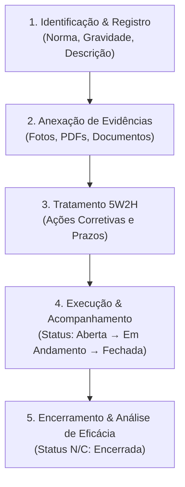

# 📋 Fluxo de Gestão e Tratamento de Não Conformidades (N/C)

**Sistema:** SISSO - Sistema de Monitoramento SSO  
**Módulo:** Gestão de Não Conformidades (`pages/4_Nao_Conformidades.py`)  
**Data de Atualização:** 2026-08-31  

---

## 📌 1. Visão Geral

O módulo de **Não Conformidades** do SISSO foi projetado para registrar, monitorar e tratar desvios normativos e procedimentais em ambientes operacionais, assegurando aderência a normas regulamentadoras (ex: **NR-12, NR-18, NR-35**) e normas internacionais de gestão (**ISO 45001, OHSAS 18001**).

O tratamento e investigação de Não Conformidades utiliza a metodologia de **Plano de Ação Corretiva 5W2H** associada a **Evidências Digitais** e **Controle Estatístico/Métricas**.

---

## 🔄 2. Ciclo de Vida da Não Conformidade



---

## 📑 3. Etapas do Módulo (`4_Nao_Conformidades.py`)

### 3.1. Aba 4: Registro de Nova Não Conformidade (`➕ Nova Não Conformidade`)
Permite o cadastro inicial do desvio identificado:
* **Data da N/C (`opened_at` / `occurred_at`):** Data em que o fato foi verificado em campo.
* **Norma de Referência (`standard_ref`):** Seleção de normas pré-configuradas (`NR-12`, `NR-18`, `NR-35`, `ISO 45001`, `OHSAS 18001`, `Outras`).
* **Gravidade (`severity`):** Classificação do risco:
  * `leve`: Risco baixo, tratável operacionalmente.
  * `moderada`: Risco médio, requer plano formal.
  * `grave`: Risco elevado, requer ação corretiva prioritária.
  * `critica`: Risco iminente / crítico, parada de atividade ou ação emergencial.
* **Status Inicial (`status`):** `aberta` ou `encerrada`.
* **Descrição Detalhada (`description`):** Contexto, local e impacto potencial.
* **Upload Imediato:** Possibilidade de anexar fotos e documentos no momento do cadastro.

### 3.2. Aba 3: Gestão de Evidências (`📎 Evidências`)
Centraliza todos os arquivos anexados à Não Conformidade:
* **Upload:** Enviado ao bucket `evidencias` no Supabase Storage via `services/uploads.py`.
* **Metadados:** Gravados na tabela `attachments` com `entity_type = 'nonconformity'` e `entity_id = <nc_id>`.
* **Download & Remoção:** Download seguro e exclusão de evidências obsoletas.

### 3.3. Aba 5: Tratamento com Metodologia 5W2H (`✅ Ações Corretivas`)
Permite estruturar a resposta ao desvio utilizando o framework 5W2H via `services/actions.py`:
* **O QUE (`what`):** Descrição da ação corretiva a ser implementada.
* **QUEM (`who`):** Responsável pela execução.
* **QUANDO (`when_date`):** Prazo final para conclusão.
* **ONDE (`where_text`):** Área/setor onde será executada.
* **POR QUÊ (`why`):** Justificativa e causa a ser mitigada.
* **COMO (`how`):** Método e etapas de execução.
* **QUANTO (`how_much`):** Custo financeiro estimado (R$).
* **Status da Ação:** `aberta`, `em_andamento`, `fechada`.

### 3.4. Abas 1 e 2: Análise, Indicadores & Registros (`📊 Análise` e `📋 Registros`)
* **Métricas Principais:** Total de N/Cs, abertas, fechadas e tempo médio de resolução (dias).
* **Gráficos Dinâmicos:**
  * Distribuição por Status (Pizza).
  * Evolução de Não Conformidades por Mês (Barras).
  * Frequência por Norma de Referência (Barras).
  * Distribuição por Gravidade (Barras).
* **Filtros Locais:** Busca por termo na descrição, filtro por norma e por status.

---

## 🗄️ 4. Estrutura de Banco de Dados

### 4.1. Tabela `nonconformities`
```sql
CREATE TABLE public.nonconformities (
    id UUID PRIMARY KEY DEFAULT uuid_generate_v4(),
    opened_at DATE NOT NULL,
    occurred_at DATE,
    standard_ref TEXT,
    severity TEXT CHECK (severity IN ('leve', 'moderada', 'grave', 'critica')),
    description TEXT,
    status TEXT DEFAULT 'aberta' CHECK (status IN ('aberta', 'tratando', 'encerrada')),
    created_by UUID REFERENCES public.profiles(id),
    created_at TIMESTAMPTZ DEFAULT now()
);
```

### 4.2. Tabela `actions` (Planos 5W2H)
```sql
CREATE TABLE public.actions (
    id UUID PRIMARY KEY DEFAULT uuid_generate_v4(),
    entity_type TEXT CHECK (entity_type IN ('accident', 'near_miss', 'nonconformity')),
    entity_id UUID NOT NULL,
    what TEXT NOT NULL,
    who TEXT,
    when_date DATE,
    where_text TEXT,
    why TEXT,
    how TEXT,
    how_much NUMERIC,
    status TEXT DEFAULT 'aberta' CHECK (status IN ('aberta', 'em_andamento', 'em_execucao', 'fechada', 'concluida', 'cancelada')),
    created_by UUID REFERENCES public.profiles(id),
    created_at TIMESTAMPTZ DEFAULT now()
);
```

### 4.3. Tabela `attachments` & Storage
```sql
CREATE TABLE public.attachments (
    id UUID PRIMARY KEY DEFAULT uuid_generate_v4(),
    bucket TEXT NOT NULL DEFAULT 'evidencias',
    path TEXT NOT NULL,
    entity_type TEXT CHECK (entity_type IN ('accident', 'near_miss', 'nonconformity', 'action')),
    entity_id UUID NOT NULL,
    uploaded_by TEXT REFERENCES public.profiles(email),
    uploaded_at TIMESTAMPTZ DEFAULT now()
);
```

---

## 🔐 5. Governança, RLS e Auditoria

1. **Isolamento de Dados (Multi-Tenant por Usuário):**
   - Usuários comuns visualizam e gerenciam exclusivamente Não Conformidades criadas por eles (`created_by = user_id`).
   - Usuários com perfil `admin` têm visibilidade global de todas as N/Cs da empresa.
2. **Registro de Logs de Auditoria (`services/user_logs.py`):**
   - Toda criação, alteração ou exclusão de Não Conformidade e Ação Corretiva gera um registro na tabela `user_logs` com `action_type`, `entity_type`, `entity_id` e metadados.

---

## 🔍 6. Integração: Não Conformidades & Investigação Formal (FTA)

O módulo de Não Conformidades está totalmente integrado ao assistente de **Investigação Formal por Árvore de Falhas (FTA)**.

### 🌟 Benefícios da Integração
* **Investigação de Causa Raiz para N/Cs Críticas:** Para desvios graves ou de alto potencial de dano, o usuário pode iniciar uma investigação formal pericial diretamente a partir da N/C.
* **Criação Automática da Árvore de Falhas:** O sistema gera automaticamente o nó raiz do desvio na tabela `fault_tree_nodes` e migra as evidências fotográficas anexadas.
* **Geração de Laudo Pericial (PDF e Word):** Emissão de laudo técnico completo nos padrões corporativos e NBR 14280.
* **Transição Fluida (Deep Linking):** Botões integrados nas abas **Registros**, **Nova Não Conformidade** e **Ações Corretivas** direcionam instantaneamente para o assistente FTA com contexto ativo no session state.

| Característica | Fluxo Padrão (5W2H) | Fluxo Expandido (Investigação Formal FTA) |
| :--- | :--- | :--- |
| **Foco** | Desvios rotineiros e planos rápidos | Desvios graves, riscos críticos e auditorias |
| **Metodologia de Causa** | Análise direta / Justificativa 5W2H | **Árvore de Falhas (FTA - Fault Tree Analysis)** |
| **Cronologia** | Data de ocorrência e abertura | **Linha do Tempo detalhada de eventos** |
| **Classificação Normativa** | NR-12, NR-18, NR-35, ISO 45001 | **NBR 14280** e Catálogo Normativo |
| **Comissão & Pessoas** | Responsável único por ação | Pessoas Envolvidas e Comissão de Investigação |
| **Emissão de Laudo** | Registros e Ações em tela | **Laudo Pericial Oficial em PDF e Word** |
