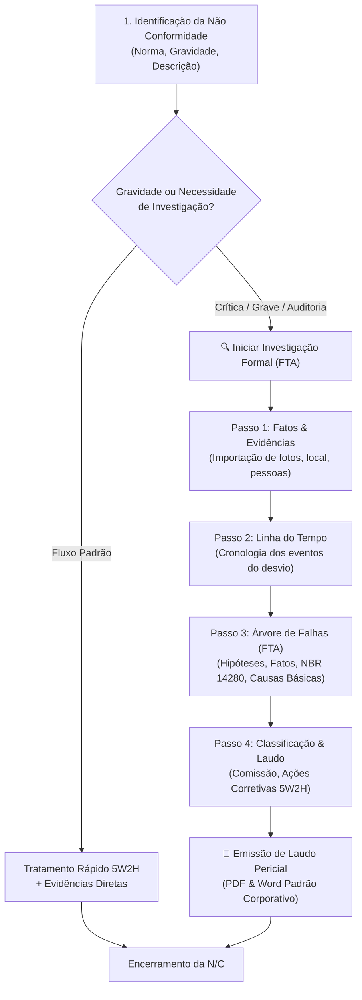

# 🌳 Investigação Formal (FTA) para Não Conformidades

**Sistema:** SISSO - Sistema de Monitoramento SSO  
**Módulo:** Gestão de Não Conformidades & Investigação Formal (FTA)  
**Arquivos Principais:** [`pages/4_Nao_Conformidades.py`](file:///Users/cristiancarlos/SISSO/pages/4_Nao_Conformidades.py), [`pages/investigation.py`](file:///Users/cristiancarlos/SISSO/pages/investigation.py), [`services/investigation.py`](file:///Users/cristiancarlos/SISSO/services/investigation.py)  
**Data de Atualização:** 2026-08-31  

---

## 📌 1. Visão Geral

O **SISSO** expandiu o motor de **Investigação Formal por Árvore de Falhas (FTA - Fault Tree Analysis)** para o tratamento de **Não Conformidades (N/Cs)** operacionais e regulatórias (ex.: NR-12, NR-18, NR-35, ISO 45001).

Anteriormente, Não Conformidades eram tratadas exclusivamente via plano de ação 5W2H e anexação simples de evidências. Com a nova integração, desvios operacionais com gravidade elevada (**Grave** ou **Crítica**) ou exigência de auditoria podem ser submetidos ao mesmo fluxo investigativo pericial dos acidentes, permitindo:

1. **Estruturação de Árvore de Falhas / Árvore de Porquês** (hipóteses, fatos, causas básicas e contribuintes).
2. **Classificação oficial por normas técnicas (NBR 14280 / Catálogo Normativo)**.
3. **Mapeamento de Linha do Tempo e Evidências Fotográficas**.
4. **Comissão de Investigação com plano de ações complementares**.
5. **Emissão de Laudo Técnico Pericial Oficial em PDF e Word (.docx) no padrão corporativo**.

---

## 🔄 2. Diagrama de Fluxo e Ciclo de Vida

---

## 🏗️ 3. Arquitetura de Software e Compatibilidade com o Banco

### 3.1. Zero-Migration (Compatibilidade 100% com o Schema Existente)
A integração foi projetada para funcionar nativamente com o banco de dados PostgreSQL/Supabase atual sem necessidade de `ALTER TABLE` ou novas migrações SQL:

* **Container de Investigação (`accidents`):** A tabela `accidents` atua como o container universal de investigação pericial:
  - `type`: Definido como `'sem_lesao'` (valor aceito no enum `accident_type`).
  - `classification`: Definido como `'Não Conformidade'`.
  - `registry_number`: Formatado como `NC-<UUID_8_CHARS>` (ex.: `NC-A1B2C3D4`), servindo como identificador único e chave de busca rápida.
  - `severity_level`: Mapeado a partir da gravidade da N/C (`leve` -> `Low`, `moderada` -> `Medium`, `grave` -> `High`, `critica` -> `Catastrophic`).
* **Nós da Árvore de Falhas (`fault_tree_nodes`):** Ao iniciar a investigação, o sistema cria o nó raiz associado ao desvio (`parent_id = NULL`), permitindo a expansão hierárquica completa.
* **Migração Automática de Evidências (`evidence` <- `attachments`):** As fotos e arquivos anexados à Não Conformidade são automaticamente vinculados à galeria da investigação pericial.

---

## 💻 4. Funções e Componentes Implementados

### 4.1. `services/investigation.py`
* **`get_nc_investigation_id(nc_id: str) -> Optional[str]`:** Verifica se a Não Conformidade já possui investigação formal associada (por `registry_number` ou metadados).
* **`get_or_create_nc_investigation(nc_id: str, nc_data: dict) -> Optional[str]`:** 
  1. Cria o registro formal de investigação.
  2. Cria o nó raiz na árvore de falhas.
  3. Importa evidências/anexos cadastrados na N/C.
  4. Retorna o ID único para deep-linking no frontend.
* **`get_accidents()`:** Normalizado para carregar `registry_number`, permitindo segmentar e identificar visualmente Acidentes vs. Não Conformidades.

### 4.2. `pages/4_Nao_Conformidades.py`
* **Aba 2 (📋 Registros):** Card de Ações Interativas onde o usuário pode selecionar qualquer N/C e verificar se há uma investigação FTA ativa, com botão direto para **"🔍 Iniciar Investigação Formal (FTA)"** ou **"🔍 Abrir Árvore de Causas (FTA)"**.
* **Aba 4 (➕ Nova Não Conformidade):** Checkbox *"🔍 Iniciar Investigação Formal (FTA) imediatamente após o registro"*, pré-ativada para gravidades Alta e Crítica.
* **Aba 5 (✅ Ações Corretivas):** Botão de atalho para acessar a Árvore de Falhas da N/C selecionada.

### 4.3. `pages/investigation.py`
* **Filtro por Categoria na Barra Lateral:** Opção de filtrar a lista entre `Todas`, `🚨 Acidentes` e `📋 Não Conformidades`.
* **Identificação Visual no Seletor:** Prefixos `[📋 N/C]` e `[🚨 Acidente]`.
* **Cabeçalho Contextual:** Identifica o tipo do registro, número de protocolo e norma aplicável.
* **Emissão de Laudos Periciais:** Geração de laudo em PDF (WeasyPrint) e Word (.docx) contendo árvore de falhas renderizada, evidências, timeline e ações da comissão.

### 4.4. `app.py`
* Navegação atualizada para exibir o menu **"🔍 Investigação Formal (FTA)"**, indicando suporte completo a acidentes e não conformidades.

---

## 📋 5. Guia do Usuário: Como Investigar uma Não Conformidade

1. **Acesse o Módulo:** No menu superior, clique em **Não Conformidades**.
2. **Identifique a N/C:** Na aba **📋 Registros**, selecione a Não Conformidade desejada no seletor inferior.
3. **Inicie a Investigação:** Clique no botão **"🔍 Iniciar Investigação Formal (FTA)"**.
4. **Preencha os Passos no Assistente:**
   - **Passo 1 (Fatos & Fotos):** Revise a descrição, adicione o local, equipe da comissão e novas fotos.
   - **Passo 2 (Linha do Tempo):** Adicione os horários e sequência dos acontecimentos do desvio.
   - **Passo 3 (Árvore de Porquês):** Crie hipóteses, valide fatos, marque **Causas Básicas** e **Causas Contribuintes**, e vincule aos códigos normativos (ex.: NBR 14280).
   - **Passo 4 (Classificação & Laudo):** Defina as ações da comissão e clique em **"📥 Gerar Relatório PDF"** ou **"📄 Gerar Relatório Word"**.
