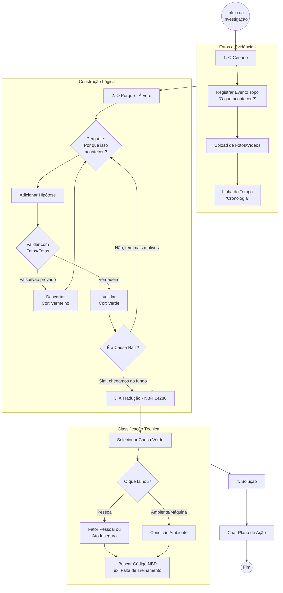

# 🎨 Melhorias de UX - Investigação de Acidentes

## Visão Geral

A interface de investigação foi completamente reformulada para ser **intuitiva e guiada**, transformando um processo burocrático em um **assistente que guia o raciocínio do investigador**.

## 🧭 Fluxo de Pensamento Implementado

O sistema segue o fluxo lógico:

```
O que houve? → Por que houve? → O que é isso na norma? → Como resolver?
```

### Fluxograma Visual



## 🎯 Melhorias Implementadas

### 1. Navegação Tipo "Wizard" (Passo a Passo)

**Antes:** Abas soltas sem contexto  
**Agora:** Barra de progresso visual com 4 passos claros

#### Características:
- ✅ **Barra de Progresso Visual**: Mostra onde o usuário está
- ✅ **4 Passos Definidos**:
  1. 📸 Fatos & Fotos
  2. 📅 Linha do Tempo
  3. 🌳 Árvore de Porquês
  4. 📋 Classificação Oficial

- ✅ **Navegação com Botões**: "Anterior" e "Próximo" em cada passo
- ✅ **Bloqueio Inteligente**: Passo 4 só desbloqueia quando há causas validadas
- ✅ **Indicadores Visuais**:
  - 🟢 Verde: Passo concluído
  - 🟡 Amarelo: Passo atual
  - ⚪ Cinza: Passo futuro

### 2. Terminologia Natural (Esconde o "Parent ID")

**Antes:** "Selecione o Parent Node ID para adicionar Child"  
**Agora:** "Por que **[Evento Selecionado]** aconteceu?"

#### Melhorias:
- ✅ **Perguntas Conversacionais**: "Por que isso aconteceu?"
- ✅ **Seleção Contextual**: "Para qual evento/causa você quer adicionar uma nova causa?"
- ✅ **Feedback Imediato**: Mostra a pergunta formatada após seleção
- ✅ **Tooltips Explicativos**: Ajuda contextual em cada campo

### 3. Feedback Visual Instantâneo (O Semáforo)

**Sistema de Cores Implementado:**

#### 🟢 Verde (`validated`)
- **Significado**: Causa confirmada (Verdadeiro)
- **Uso**: Quando há evidências que confirmam a causa
- **Ação**: Pode ser classificada com código NBR

#### 🔴 Vermelho (`discarded`)
- **Significado**: Causa descartada (Falso)
- **Uso**: Quando há evidências que descartam a causa
- **Visual**: Riscado no gráfico

#### ⚪ Cinza (`pending`)
- **Significado**: Em análise (Investigando...)
- **Uso**: Hipótese levantada, ainda não validada
- **Ação**: Precisa ser validada ou descartada

#### 🟠 Laranja (Borda)
- **Significado**: Causa confirmada que precisa de classificação NBR
- **Uso**: Causa validada mas sem código NBR vinculado
- **Ação**: Ir para Passo 4

### 4. Busca Inteligente para NBR (O "Tradutor")

**Antes:** Selectbox com 300 opções  
**Agora:** Busca por palavras-chave + filtro por categoria

#### Características:
- ✅ **Campo de Busca**: Digite palavras-chave (ex: "treinamento")
- ✅ **Filtro por Categoria**: 
  - Falha Humana (Ato Inseguro)
  - Condição do Ambiente
  - Fator Pessoal
- ✅ **Resultados Filtrados**: Mostra apenas códigos relevantes
- ✅ **Descrição Completa**: Exibe código + descrição completa
- ✅ **Feedback Visual**: Mostra código selecionado em destaque

## 📋 Detalhes de Implementação

### Barra de Progresso

```python
def render_progress_bar(current_step: int, total_steps: int = 4):
    """Renderiza barra de progresso visual"""
    # Cria colunas para cada passo
    # Mostra status: concluído, atual, futuro
    # Barra de progresso linear
```

### Interface Conversacional

**Passo 3 - Árvore de Porquês:**
- Pergunta: "Por que isso aconteceu?"
- Seleção: "Para qual evento/causa você quer adicionar uma nova causa?"
- Feedback: "Por que **[Evento Selecionado]** aconteceu?"

### Validação com Cores

**Botões de Validação:**
- ✅ **Confirmar/Verdadeiro** (Verde)
- ❌ **Descartar/Falso** (Vermelho)
- ⏳ **Em Análise** (Cinza)

### Busca NBR

**Fluxo:**
1. Seleciona categoria (Ato, Condição, Fator)
2. Digita palavras-chave
3. Sistema filtra códigos relevantes
4. Seleciona código
5. Vê descrição completa
6. Salva classificação

## 🎨 Elementos Visuais

### Cores do Semáforo

```css
Verde (Confirmado):   #28a745
Vermelho (Descartado): #dc3545
Cinza (Em Análise):   #6c757d
```

### Legenda Visual

Cada passo mostra uma legenda explicando as cores:
- 🟢 Verde = Causa confirmada
- 🔴 Vermelho = Causa descartada
- ⚪ Cinza = Em análise

## 💡 Tooltips e Ajuda Contextual

Cada campo importante tem `help="..."` explicando:
- **Upload de Fotos**: "Faça upload de fotos que documentem o acidente..."
- **Adicionar Causa**: "Liste todas as causas possíveis, mesmo que não tenha certeza..."
- **Validar**: "Use quando tiver evidências que confirmam/descartam esta causa"
- **Buscar NBR**: "Digite palavras relacionadas à causa..."

## 🔄 Fluxo de Navegação

### Bloqueios Inteligentes

1. **Passo 1 → 2**: Sempre permitido
2. **Passo 2 → 3**: Sempre permitido
3. **Passo 3 → 4**: Só desbloqueia se houver pelo menos 1 causa validada
   - Mensagem: "💡 Valide pelo menos uma causa para continuar"

### Botões de Navegação

- **Anterior**: Volta para passo anterior
- **Próximo**: Avança para próximo passo (se desbloqueado)
- **Estilo**: Botões grandes e claros com ícones

## 📊 Comparação: Antes vs. Depois

### Antes (Burocrático)
- ❌ Abas soltas sem contexto
- ❌ Terminologia técnica ("Parent ID", "Node Type")
- ❌ Sem feedback visual claro
- ❌ Lista gigante de códigos NBR
- ❌ Sem guia de progresso

### Depois (Intuitivo)
- ✅ Wizard passo a passo
- ✅ Perguntas conversacionais
- ✅ Semáforo visual (verde/vermelho/cinza)
- ✅ Busca inteligente NBR
- ✅ Barra de progresso clara

## 🎯 Objetivos Alcançados

1. ✅ **Não parece banco de dados**: Interface conversacional
2. ✅ **Guia o raciocínio**: Fluxo lógico passo a passo
3. ✅ **Feedback visual**: Cores e indicadores claros
4. ✅ **Terminologia natural**: Sem jargão técnico
5. ✅ **Busca inteligente**: NBR fácil de encontrar
6. ✅ **Progresso claro**: Usuário sabe onde está

## 🚀 Próximos Passos (Opcional)

- [ ] Adicionar passo 5: "Plano de Ação"
- [ ] Exportação de relatório PDF
- [ ] Sugestões automáticas de códigos NBR baseadas em palavras-chave
- [ ] Histórico de alterações na árvore
- [ ] Modo "revisão" para investigações fechadas

---

**Transformado de banco de dados burocrático em assistente intuitivo que guia o raciocínio do investigador** 🎯

